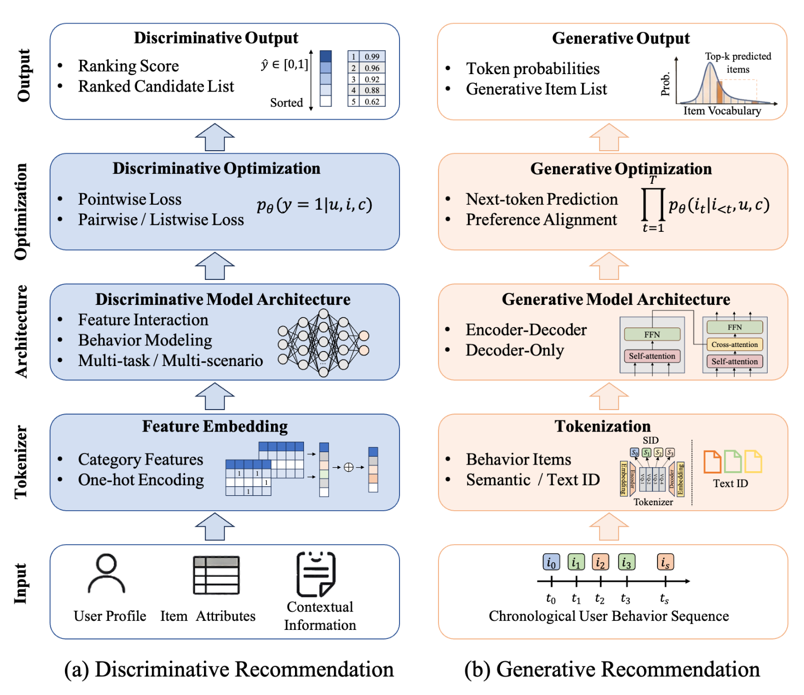
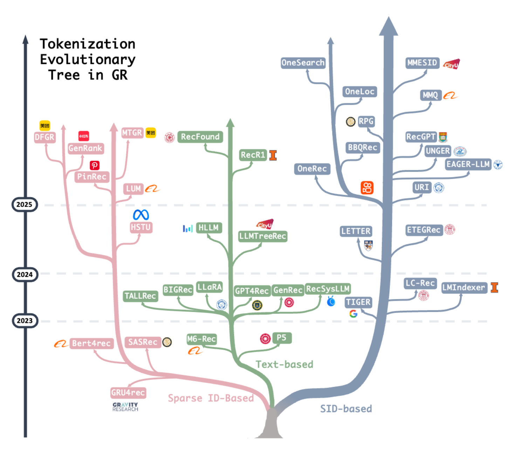
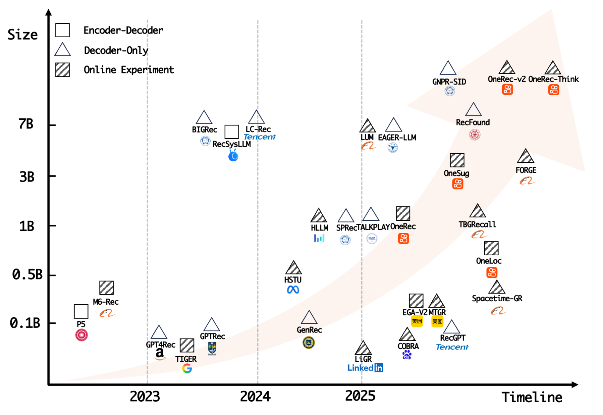
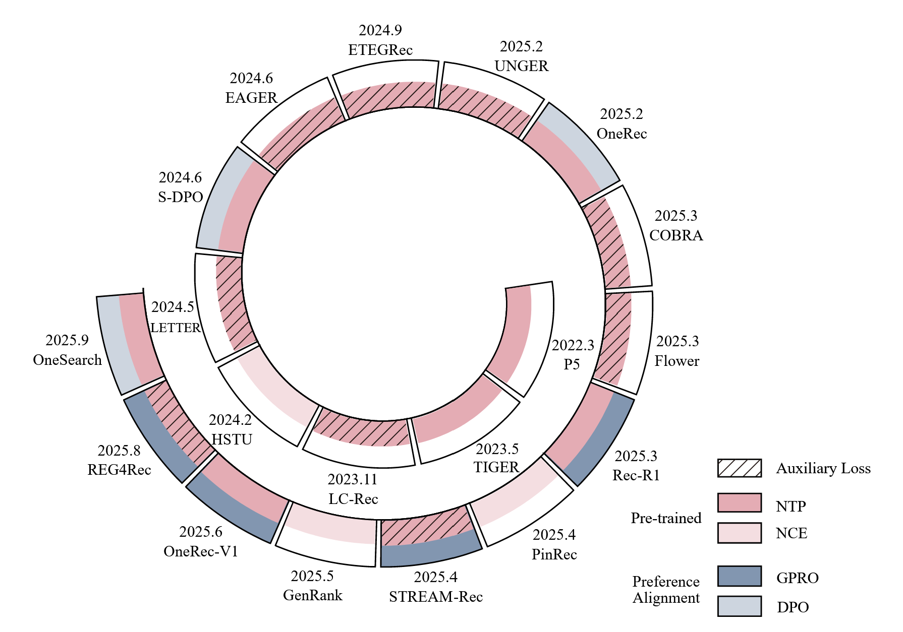

## A Survey of Generative Recommendation from a  Tri-Decoupled Perspective: Tokenization,  Architecture, and Optimization

### 研究背景

#### 判别式&生成式推荐范式比较

#### 判别式推荐模型

基于评分的框架：处理物品、用户和上下文特征，以预测诸如点击、点赞或购买等参与概率。

级联判别框架：召回、粗排、精排和重排。

不足：

1. 冷启动问题：新笔记缺少与用户的交互，其Embedding ID没有得到很好的学习，导致推荐的难度大、效果差。
2. 计算效率低下：Embedding表参数量大（消耗了超过90%的参数），但它们又是稀疏的；判别式架构中各种专门的小规模算子（比如特征交叉部分和deep部分等等）可能会产生相当大的通信和数据传输开销，导致现有模型的硬件利用效率严重受限，模型浮点运算次数利用率（MFU）通常低于5%（大语言模型在训练期间的MFU达到>40%）。
3. 扩展能力受限：投入生产的判别式推荐系统通常采用规模中等的模型（dense MLP<0.1B），这限制了它们的扩展能力（大语言模型Emergent Capabilities：在小规模模型中不存在，但当模型规模（参数量、训练数据或计算量）跨越某个临界阈值时，突然出现的、意料之外的能力）。
4. 仅学习局部决策边界：仅仅寻找区分正负样本的那条线，浪费了负样本内部的关系信息，但生成式 NTP 模型可以利用了序列中每个 Token 之间的深层语义学习联合概率分布，从而具备“全局感知”的能力。
5. 累积误差：多阶段级联（召回、粗排、精排和重排）不可避免地引入了累积误差，随着信息的逐步丢失，推荐质量会下降。（漏斗效应与“不可逆”的信息丢失、目标不一致导致的累积误差 、缺乏全局视野的“局部最优”）

#### 生成式推荐模型

**Tokenization**：在语义层面进行分词，解决冷启动问题、跨域挑战以及且词汇表稀疏冗余的问题。

**Architecture**：生成模型结构（encoder-decoder， decoder-only），解决MFU利用率低下及可扩展性问题。

**Optimization**：在训练角度，NTP的生成模型可捕捉物品的完整概率分布，并对整个用户行为生成过程进行建模，解决仅学习局部决策边界问题。偏好对齐策略，基于RL能够直接与用户的多维偏好和平台级目标对齐，进一步可实现端到端优化，解决累积误差问题。

### 研究内容

#### **Tokenization**

##### 阶段1：**稀疏ID (Sparse ID)**

沿用传统推荐的随机ID，无语义，但能避免ID冲突。

HSTU、MTGR、LUM、PinRec、GenRank、DFGR

局限性：

1. 缺乏多模态语义信息：ID是随机分配的，因此没有任何内在语义含义。
2. 冷启动问题：由于稀疏ID嵌入是从交互数据中学习的，交互不足的长尾和冷启动物品会面临特征学习不足的问题。
3. 词汇爆炸：庞大的物品词汇导致下一个物品预测的输出空间过大，使得生成建模方法难以有效适应。

##### **阶段2：文本ID (Text ID)**

直接利用LLM的词表，用自然语言描述物品， 语义丰富，显著缓解冷启动和长尾问题，实现跨域通用性以及少样本或零样本推荐能力，增强可解释性和对话交互能力，利于交互式推荐系统。

M6-Rec、LLMTreeRec、TallRec、BIGRec、S-DPO

挑战：

大语言模型通常使用 BPE 或 WordPiece 等分词算法，一个复杂的物品名称（如“The Lord of the Rings”）会被切分成十几个词元。模型在计算**协作关系**时，必须在这些破碎的词元之间建立联系，这极大地增加了学习难度。传统推荐模型（如 FM, DeepFM）中，一个物品就是一个ID（向量）。但在纯文本 LLM 中，模型很难建立“物品A 的一串词元”与“物品_B 的一串词元”之间的强相关性（即“购买了 A 的人也买了 B”）。

解决方案：

跨越多个原始词元的实体表示：

- 不再强求用原始的文本词元来代表物品，而是为每个物品分配一个特殊的虚拟 Token（例如 `[ITEM_6421]`）
-  LLaRa的做法：在训练期间将从传统推荐模型获得的物品表示与物品的固有文本属性相结合。然后使用混合特征通过LoRA逐步微调大语言模型，从而使推荐模型能够整合协作和语义信息。
- 对一个物品描述对应的所有原始词元向量进行聚合（如 Mean Pooling 或引入一个额外的查询向量），将多维的词元序列压缩成一个单一的实体表示。

局限性：

1. 基于文本的项目描述需要大量词元，从而降低了计算效率。
2. 生成的文本词元可能无法有效地与实际物品相关联，导致推荐中的模糊性和不准确。

##### 阶段3：语义ID (Semantic ID / SID) 

通过量化技术（如RQ-VAE）将物品特征压缩为短小的离散编码序列，兼顾语义与效率。解决稀疏ID方法的语义有限和词汇稀疏问题以及基于文本方法的表示效率低下和物品关联困难挑战。

语义ID构建过程：

1. 物品的语义信息（例如，文本信息或图像）通过预训练的嵌入模型转换为语义嵌入，例如用于文本的BERT和用于多模态的CLIP。

2. 语义嵌入通过量化方法量化为语义ID序列，一个码字元组$ \left( {{c}^{0},{c}^{1},{c}^{2}}\right) $，其中每个码字（codeword）来自不同的码本（codebook），以RQ-VAE为例：

   对于每个物品，其语义信息首先被编码为语义表示$ z $，然后量化器执行多级量化。在每个级别$ l $，算法从码本$ {\left\{  {\mathbf{v}}_{k}^{l}\right\}  }_{k = 1}^{K} $中识别出最接近当前潜在表示输入$ z $​的码向量：
   $$
   {c}^{l} = \underset{k}{\arg\min}{\begin{Vmatrix}\mathbf{z} - {\mathbf{v}}_{k}^{l}\end{Vmatrix}}_{2}^{2} 
   $$
   然后残差$ {\mathbf{r}}^{l + 1} = \mathbf{z} - {\mathbf{v}}_{{c}^{l}}^{l} $用作后续量化级别的输入，并且这个过程迭代地继续直到所有$ L $级别完成。

嵌入提取方式：静态+、协作信号、语义跨模态嵌入、位置特征。

量化方式：RQ-VAE+、ResKmeans（限制可以分配给任何码字的最大物品数）、并行量化方法）（同时预测多个ID：PQ、FSQ）。

挑战：

1. SID冲突：多个不同的物品被映射到相同的SID序列。在RQ-VAE或ResKmeans中，学习到的质心往往分布不均或坍塌，大多数物品聚集在少数几个主导质心周围，而尾部质心几乎没有或没有分配到物品，导致码本利用率低下。
2. 目标不一致：生成式推荐中多阶段训练产生的目标不一致，它通常包括三个阶段：嵌入提取、SID量化和生成模型训练。
3. 多模态集成：物品的内在语义内容+协作信号、视觉、地理位置。
4. 可解释性与推理：基于SID的图推理（GR）模型缺乏可解释性，并且无法利用大语言模型固有的世界知识和推理能力。

解决方案：

1. 在码本训练期间引入了额外的优化目标，以鼓励更平衡的质心分布：SaviorRec的Sinkhorn算法采用熵正则化损失来强制物品到聚类质心的分配更加均匀；OneRec和LETTER对每个残差利用约束k均值，这限制了可以分配到每个质心的物品的最大数量；TIGER在SID末尾添加一个随机令牌，而CAR添加物品稀疏ID；OneSearch使用ResKmeans对物品的共享特征进行编码，并进一步使用优化乘积量化（OPQ）对最终SID令牌中的独特特征进行编码，从而提高SID的独特性。

2. LMIndexer的自监督SID训练框架直接将物品文本编码成一系列SID，然后尝试用这些SID重新还原（重构）原始的物品文本；URI将模型定义为既是索引器（编ID）又是检索器（做推荐），利用 EM（期望最大化）算法，在迭代中让索引和检索两个任务互相逼近、共同进化；ETEGRec提出一个端到端框架，将分词器和推荐模型放在一起训练，引入了“序列-物品”对齐和“偏好-语义”对齐损失函数，强制两者在同一目标下对齐；MMQ引入软索引机制，将物品表示为码本向量的加权组合，而不是硬性的离散选择，使梯度可以从推荐任务直接回传给分词器，实现协同训练。

3. | **融合阶段 / 类型**                     | **代表模型**     | **核心解决方案与机制**                                       |
   | --------------------------------------- | ---------------- | ------------------------------------------------------------ |
   | **嵌入提取阶段** (Embedding Extraction) | QARM, OneRec     | 利用真实的用户-物品行为作为监督信号，对预训练的多模态模型进行微调。 |
   |                                         | UNGER            | 在多模态嵌入与协作嵌入（行为信号）之间进行对比对齐。         |
   |                                         | OneLoc, GNPR-SID | 在原始嵌入中注入地理位置等特定场景信息。                     |
   | **量化处理阶段** (Quantization Phase)   | EAGER            | 对不同模态（如图像、文本）分别进行独立量化。                 |
   |                                         | MME-SID, LETTER  | 采用对比学习增强不同模态间的对齐与融合一致性。               |
   |                                         | MMQ              | 采用MoE（混合专家）架构，维护模态特定码本与共享码本，通过路由进行加权聚合。 |
   |                                         | BBQRec           | 提出行为对齐的量化方法，从多模态数据中提取与行为相关的特征。 |
   | **序列位置分配** (Position Allocation)  | TALKPLAY         | 将不同模态分别编码为语义ID序列中的独立位置。                 |
   |                                         | EAGER-LLM        | 规定码本层级：前两层建模多模态信息，后两层建模协作信号。     |

4. 将SID标记作为新的词汇条目纳入语言模型：PLUM采用诸如SID-to-Title 和 SID-to-Topic等预训练任务使大语言模型具备获取SID标记与自然语言描述之间语义对应关系的能力；OneRec-Think将“推理”与“检索”结合，引入了一个中间推理层，让模型先在连续的语义空间中“思考”用户的意图、场景和潜在需求，然后再将这些思考映射回离散的推荐物品。

##### 未来研究问题

1. 物品关联冲突率
2. 新物品：分辨率拓展、codebook在线增量、更新...
3. 跨场景泛化
4. 对分词器的评估：评估分词器是否真正针对下游生成式推荐性能进行优化

#### Architecture

##### Encoder-Decoder Architecture

有效平衡用户偏好理解和下一项生成

将预训练的Encoder-Decoder语言模型直接迁移到推荐任务中：P5（T5）、M6-Rec（M6）、RecSysLLM（GLM） 缺乏协作信号、语言建模目标与推荐目标根本上不一致、推理的高开销。

设计专门针对推荐任务的Encoder-Decoder架构：TIGER（T5，将推荐形式化为“语义ID序列生成”问题）、OneRec（端到端）、基于场景特征进行架构优化（One-Sug、One-Search、OneLoc、EGA-V2）。

##### Decoder-only Architecture

Encoder-Decoder Architecture理解和生成之间具有不平衡性，Decoder-only Architecture更具可扩展性和计算效率（特别是长序列行为上下文建模）

直接使用预训练的仅解码器语言模型作为推荐的backbone：

- 使用SFT任务促使语言模型生成目标项目的文本描述，再将生成的文本映射回具体的项目候选（GenRec、BIGRec、Rec-R1、GPT4Rec、RecFound和Llama4Rec） 文本ID
- 引入专用语义ID（MME-SID、EAGER-LLM、RecGPT，以及SpaceTime-GR、TALKPLAY和GNPR-SID、OneRec-think）

从头构建专门为推荐任务量身定制的decoder-only生成架构：

- 基础生成：RecGPT和FORGE，在大规模用户交互序列上进行自回归训练，以基于预训练的语义ID标识符直接生成下一个物品。
- 混合控制：SynerGen引入任务特定的掩码矩阵，以统一搜索和推荐任务，控制信息流；COBRA融合稀疏语义ID和密集嵌入（Dense Embeddings），在解码器中联合预测，以此桥接生成式推荐与传统检索模型的差距。
- 推理效率：RPG采用多Token预测机制，CAR采用分块（Block-wise）自回归，打破逐个Token生成的串行延迟瓶颈。OneRec-V2设计了“Lazy Decoder”，通过共享Key-Value对并省略部分投影操作，在保持性能的同时大幅降低计算开销。
- HSTU：将用户数据组织为交织了“物品”和“动作”的序列，并用点对点聚合注意力取代传统的Softmax，以更好地捕捉用户偏好强度。衍生：MTGR、INTSR、LiGR。

##### Diffusion-based Architecture

Diff4Rec、CaDiRec、RecDiff、DDRM、DiffCL、DimeRec、DiffGRM

##### 挑战

1. 在延迟约束下进行实时部署
2. 支持各种场景和任务的整体生成框架

#### Optimization

##### 监督学习

NTP建模：

进一步修改训练目标以更好地匹配实际目标：TIGER、LETTER（排序引导生成损失）、COBRA（稀疏 ID 预测和稠密向量预测复合损失函数）、REG4Rec（辅助类别预测任务）、UNGER（模态内知识蒸馏，补偿Tokenization过程中的信息丢失）。

微调大模型：将推荐看作是 LLM 的一种“下游翻译任务”，将用户行为被序列化为文本提示作为大语言模型的输入，然后通过全参数更新或通过参数高效调整方法（例如LoRA）进行微调，LC-Rec（对齐自然语言和协作信息）、RecFound（稳定多任务训练的收敛，生成+嵌入）、EAGER-LLM（退火适配器微调）。

NCE（噪声对比估计）建模：

当采用**稀疏 ID (Sparse IDs)** 作为物品表示时，词表规模很大，导致传统的NTP在计算全词表 Softmax时会出现计算效率低下、显存爆炸以及梯度消失等问题。

HSTU和GenRank（采样 Softmax）、PinRec（多 Token目标，弥补推荐序列中“严格顺序”不显著的问题）、IntSR（难负采样，InfoNCE 损失，并强制仅将实际发生过交互时的非目标项视为负样本）、SessionRec（会话与排序结合）、MTGR（保留用户-物品交叉特征，使用判别式损失函数进行优化）。

挑战：只能学习观测到的行为，无法优化长期价值（如GMV、多样性）或平台规则。

##### 偏好对齐

借鉴LLM的RLHF思路，使推荐结果符合用户长期满意度和平台目标。

DPO建模：

通过正负样本对直接优化模型，无需显式奖励模型。

正/负二元对立：S-DPO（一对多负样本）、RosePO（选择性拒绝采样）、SPRec（动态从模型之前的预测结果中筛选出难负样本）。

结合启发式规则与多任务预测模型：OneLoc（生成-评价框架）、OneSug（多层级偏好对）、OneSearch（三塔奖励引导）。使模型能够捕捉连续的偏好强度而不是二元区分。

GRPO建模：

当前的研究通常采用一种混合奖励系统，该系统整合了多种反馈源，这些反馈源大致可分为基于规则的信号和基于模型的信号。

基础对齐：VRAgent-R1（格式合规性）、STREAM-Rec（正负分级行为奖励）。

后验排序指标引入：Rec-R1（NDCG指标）、RecLLM-R1（最长公共子序列算法）。

结合基于规则的信号和预测模型信号：OneRec，且引入早期裁剪策略优化（ECPO）。

显式推理引入：OneRec-Think（思维链推理奖励）、REG4Rec（多token生成以扩展推理空间及自我反思剪枝）、RecZero（结构化推理模板和基于规则的奖励）。

优化方向：

1. 增强生成式推荐模型的推理能力，更准确地推断用户偏好、意图以及从历史交互中演变的思维模式。
2. 从基于规则或特定模型的单一方面奖励评分，过渡到统一的奖励智能体，其能自动理解并平衡多维偏好，提供一个更具通用性和鲁棒性的对齐信号。
3. 提供列表式奖励信号，特别对于短视频或电子商务等基于列表的推荐场景。

### 挑战与未来研究方向

#### 端到端建模

端到端建模消除了多阶段级联带来的误差累积并提升了效率，但仍面临两大挑战：

1. 模型扩展：探索在保持可接受推理延迟的同时，将模型规模进一步扩大至大语言模型（LLM）的水平，以挖掘“涌现”能力。
2. 统一奖励设计：开发统一奖励智能体，利用 LLM 的角色扮演和理解能力，自动平衡用户级和平台级的多维偏好，减少人工干预。

#### 效率优化

生成式推荐得益于 Transformer 架构，可以继承 LLM 的硬件加速技术，但仍缺乏针对推荐场景的优化：

1. 算法-系统协同设计：缺乏针对大规模流式训练和低延迟、高吞吐推理的专用协同设计框架。由于工业级系统每天处理数亿条流式样本，设计能跟上数据更新速度的高效训练和对齐框架至关重要。
2. 超长序列建模：探索更高效的范式，如记忆增强结构和RAG训练范式，以处理超长用户行为序列。

#### 推理能力

受Deepseek-R1和OpenAI-o3等推理模型启发，生成式推荐希望利用推理链来推断用户意图，但面临以下难题：

1. 推理链构建：缺乏针对个性化推荐的大规模思维链（CoT）生成方法。由于用户特征的独特性，人类专家或 LLM 很难直接产出有效的推理链数据。
2. 自适应与自进化：模型需要根据查询难度自适应地调整推理深度（避免过度思考以满足延迟要求）。此外，开发能从在线反馈中反思和修正策略的自进化系统，同时避免偏见放大和灾难性遗忘，是一个重要方向。

#### 数据优化

1. 训练数据偏差：历史交互数据主要包含正向行为，天然存在曝光偏差和位置偏差。传统的去偏方法难以直接应用，需要设计针对生成式模型的去偏策略。
2. 高质量数据构建：尽管交互数据丰富，但缺乏高质量的思维链数据、多维偏好对齐数据以及显式的意图标注数据。

#### 交互式智能体

1. 个性化对话：当前系统难以提供符合用户个人风格的对话和推荐理由。
2. 用户中心记忆机制： 需要设计专门针对对话推荐场景的记忆机制，以增强模型对用户的多面理解和长期记忆能力。

#### 从推荐走向生成

随着 Sora 和 Kling 等模型的出现，行业正从“推荐现有内容”向“生成新内容”（如生成视频、广告素材）转变，以解决供需不匹配问题。

1. 稀疏反馈挑战：生成的内容具有高度个性化和唯一性，导致反馈信号极度稀疏，增加了算法优化的难度。
2. 成本与价值权衡：生成式模型的资源消耗巨大，需要平衡生成成本与其创造的潜在商业价值。