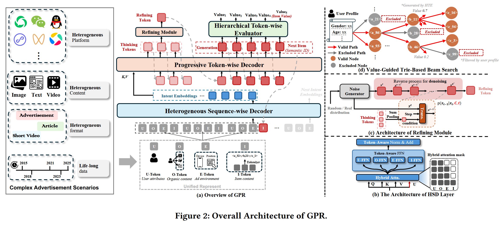
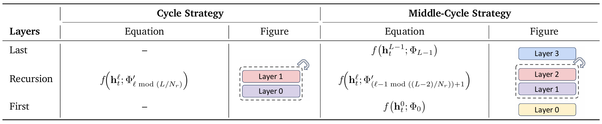

# GPR: Towards a Generative Pre-trained One-Model Paradigm for Large-Scale Advertising Recommendation

现有的生成模型在实际工业应用中面临挑战：

1. 数据与行为的极端异质性：广告通常与短视频、社交动态和新闻文章等有机内容交织在一起，导致序列和项目层面的异质性以及多样的用户行为。
2. 效率 - 灵活性权衡：在工业规模的广告推荐中，模型不仅要支持大规模数据更新的高效训练，还要提供灵活的解码能力，以实时处理超长的用户行为序列并在多种约束（例如目标定位、出价、预算）下匹配广告。
3. 收益与多利益相关方价值优化：广告推荐系统必须在多个利益相关方之间最大化整体生态系统价值——平衡用户体验、广告商投资回报率（ROI）和平台收益。

## GPR

### 创新1：统一表征与 RQ-Kmeans+

为了处理极其复杂的广告场景（包括视频、文章、用户属性等），GPR 重新设计了输入 schema 和量化方式 。

#### 1. 四类统一 Token

- **U-Token:** 用户属性与偏好。
- **O-Token:** 有机内容（短视频、文章）。
- **E-Token:** 广告请求的即时上下文环境。
- **I-Token:** 用户交互过的广告项。

#### 2. RQ-Kmeans+ 量化模型

传统的量化方法（如 RQ-VAE）容易出现 **“码本崩溃 (Codebook Collapse)”**。

**创新点：** 先使用 RQ-Kmeans 生成高质量初始化权重，再通过残差连接稳定训练。

**效果：** 碰撞率显著降低（从 23.21% 降至 20.60%），语义一致性（PAS）提升至 0.992。

### 创新2：异构层次化解码器 (HHD)

GPR 抛弃了简单的 Decoder-only 结构，提出了 **“理解-思考-细化-生成”** 的四阶段范式。

#### 层次化架构组成

**异构序列解码器 (HSD):** 引入混合注意力机制（Hybrid Attention），允许 Prompt 区域双向观察，打破因果掩码的限制。

**混合注意力机制**

- 前缀双向观察 (Bi-directional Attention)：在序列开头的 Prompt 区域（即 U/O/E-Token 部分），模型允许 Token 之间自由地互相观察。这意味着 U-Token 可以根据 E-Token（当前的即时环境）来调整自己的表示 。

- 生成阶段回归因果：只有到了预测 **I-Token（广告项）** 的生成阶段，模型才恢复严格的因果掩码，确保生成过程符合逻辑。

除了掩码的变化，HSD 的注意力机制还加入了一个额外的嵌入向量 $U$，用于动态调制注意力权重 ：

$$\text{HybridAttn}(\cdot) = \text{Softmax}\left(\frac{QK^T}{\sqrt{d_k}} + M^{hybrid}\right) V \odot U$$

**$M^{hybrid}$：**定义了哪些位置可见 。对于前缀部分的 Token $i$ 和 $j$，其值设为 $0$（可见）；只有当 $j > i$ 且处于生成区域时才设为 $-\infty$（不可见）。

$U$ 向量：允许模型更有效地聚焦于相关的用户行为，同时主动减弱噪声干扰 。

**Token 感知（Token-Aware）设计**

在广告系统中，用户属性（U）、自然内容（O）和广告（I）的特征空间完全不同。如果共用一套 LayerNorm 和 FFN，模型会被频率更高的自然内容数据带偏。通过 Token-Aware 设计，HSD 让每类 Token 都在自己的“语义子空间”内进行归一化和变换。

**递归混合机制 (MoR, Mixture-of-Recursions)**

MoR 允许模型根据 Token 的复杂度动态决定计算量 。对于简单的用户行为，模型计算路径较短；对于复杂的交互，则通过递归增加深度 。这种“按需计算”的能力使 GPR 在处理超长序列时表现出更强的推理鲁棒性。

**渐进式 Token 解码器 (PTD):** **Thinking Tokens:** 生成 $K$ 个思考 Token 以过滤冗余信息。

**第一步：Thinking（信息蒸馏）**

动作：模型首先生成 $K$ 个 **Thinking Tokens**。

意义：用户意图通常包含大量冗余和噪声 。这些思考 Token 的作用是“去粗取精”，从复杂的意图嵌入中蒸馏出核心信号，过滤掉无关干扰。

**第二步：Refining（自适应细化）**

动作：引入基于 扩散模型（Diffusion Paradigm） 的细化模块。

意义：即使有了初步思考，推理结果仍可能存在偏差。Refining 模块通过一个条件去噪过程（Conditional Denoising），对初步推理结果进行多次修正和优化 。这就像 o1 在思考过程中不断审视并修正自己的思路。

**第三步：Generation（最终决策）**

动作：在思考和细化 Token 的共同引导下，生成最终代表广告项的语义 ID 序列。

**Refining Module:** 基于扩散模型（Diffusion）范式对推理结果进行去噪细化。

**层次化 Token 评估器 (HTE):** 在生成过程中同步预测 eCPM、CTR 等业务指标，用于剪枝和拍卖。

### 创新3：三阶段联合训练策略

#### 1. 多 Token 预测 (MTP)

为了捕获用户并行的多兴趣，GPR 扩展了 $N$ 个并行头（默认为 $N=4$），同时预测多条兴趣路径。

$$L_{MTP}=-\sum_{j=1}^{N}\sum_{t=1}^{T}\sum_{l=1}^{L}\omega_{j}^{H}\cdot \log P_{j}(I_{j,t,l}|S,C,I_{j,t,1:l-1})$$

#### 2. 价值感知微调 (VAFT)

通过在损失函数中引入 **eCPM 权重**，让模型优先学习高价值广告，实现业务对齐。

#### 3. 强化学习与 HEPO 算法

**HEPO (Hierarchy Enhanced Policy Optimization):** 针对层次化决策中的信度分配（Credit Assignment）问题，为中间决策步骤提供“过程奖励（Process Rewards）”。

核心机制：HEPO 为每一个层级的中间决策（Intermediate Decisions）都构建了独立的**过程奖励** 。

**技术细节：**

偏好信号 ($\Delta_l$)：模型会查看用户历史上对该层级 Token（如“手机”类别）的交互频率，计算一个偏好得分。

分层奖励公式：在中间层级（$l < L$），奖励不再是 0，而是根据偏好信号生成的奖励 $r_l$；只有到了最后一层，才使用模拟器返回的最终业务价值 $R$。

优势：这种设计为上层（粗粒度）决策提供了直接的监督信号，缓解了梯度回传时的搜索空间过大和方差过高的问题。

奖励公式：

$$r_{l} = \begin{cases} \max(0, \Delta_{l}), & l < L \\ R, & l = L \end{cases}$$

其中 $R$ 是模拟器返回的最终业务价值。

### 总结与思考

**技术突破：** GPR 证明了在极高吞吐量、低延迟要求的工业级广告场景下，**生成式单模型完全可以取代级联架构** 。

**全局最优：** 通过统一表征与强化学习，实现了用户体验、广告主 ROI 与平台收入的全局平衡 。

**未来方向：** 随着模型规模持续扩展，生成式推荐有望实现更深层的跨模态语义对齐 。