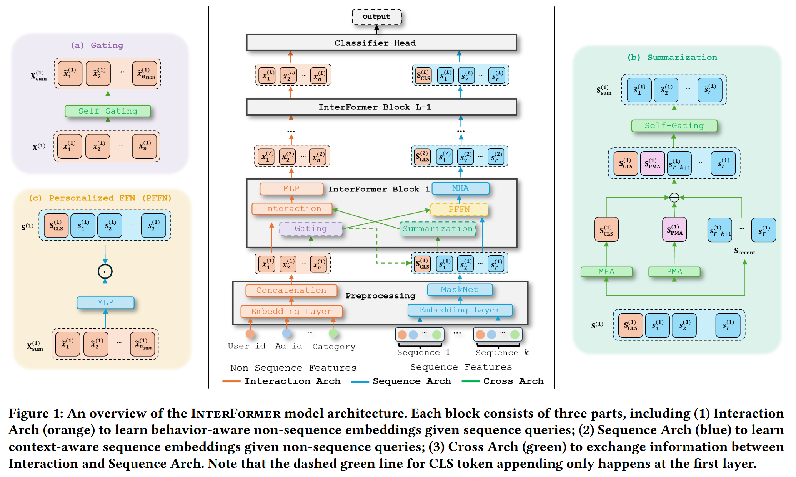
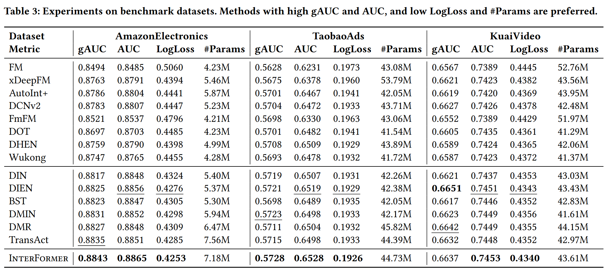
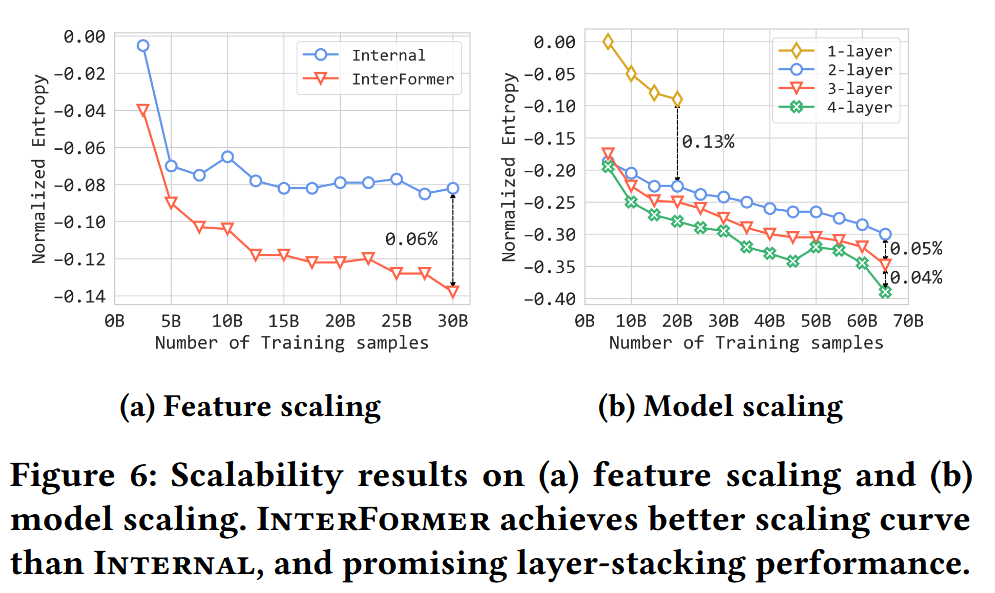

# InterFormer: Effective Heterogeneous Interaction Learning for Click-Through Rate Prediction

异构交互学习在 CTR 预测中的创新应用

### 异构交互学习

痛点1：模式间交互不足

现有模型多为“单向流”：用用户画像指导序列学习，但序列对画像的反向增强被忽视。

痛点2：信息聚合过激

为节省算力，早期常使用Pooling、Sum等手段粗暴压缩序列，导致严重信息损失。

以往工作：

#### 非序列模型

建立高阶交互：FM学习低阶交互，DNN学习高阶交互

scaling law：DHEN[79]集合了多个交互模块，Wukong[78]堆叠了FM来学习交互的层次结构

#### 序列模型

马尔可夫模型、RNN、注意力机制

#### 特征交互

##### inner product

$$f_{FM}(\mathbf{x}) = \sum_{j=1}^{d} \sum_{k=j+1}^{d} \langle \mathbf{v}_j, \mathbf{v}_k \rangle \mathbf{x}(j)\mathbf{x}(k) + \sum_{j=1}^{d} w_j \mathbf{x}(j) + w_0.$$

##### Deep & Cross Network (DCNv2)

$$\mathbf{x}^{(l+1)} = \mathbf{x}^{(0)} \odot (\mathbf{w}^{(l)}\mathbf{x}^{(l)} + \mathbf{b}^{(l)}) + \mathbf{x}^{(l)}.$$

##### Deep Hierarchical Ensemble Network (DHEN)

$$\mathbf{X}^{(l+1)} = \text{Norm} \left( \text{Ensemble}_{i=1}^{k} \text{Interaction}_i(\mathbf{X}^{(l)}) + \text{ShortCut}(\mathbf{X}^{(l)}) \right).$$

### InterFormer

#### Interaction Arch

学习“行为感知”的非序列嵌入

$$\mathbf{X}^{(l+1)} = MLP^{(l)}(Interaction^{(l)}([\mathbf{X}^{(l)} || S_{sum}^{(l)}])).$$

将非序列特征与 **Cross Arch** 提取的序列摘要 $S_{sum}$ 拼接，通过 DHEN 或 DCNv2 等模块进行高阶交互。

让静态画像感知用户当前的动态需求（如：通过近期浏览历史修正画像偏好）

------

#### Sequence Arch

学习“上下文感知”的序列嵌入 

$$\mathbf{S}^{(l+1)} = MHA^{(l)}(PFFN(\mathbf{X}_{sum}^{(l)}, \mathbf{S}^{(l)})).$$

$$PFFN(\mathbf{X}_{sum}^{(l)}, \mathbf{S}^{(l)}) = f(\mathbf{X}_{sum}^{(l)}) \mathbf{S}^{(l)}.$$

sequence token利用旋转位置编码；

输出 $S^{(l+1)}$ 与输入 $S^{(l)}$ 具有相同的形状，所以可以避免激进的聚合并且可以轻松地对层数进行堆叠。

利用画像摘要作为 Query，动态生成投影权重，对序列进行个性化变换。

------

#### Cross Arch

$$\mathbf{X}_{\text{sum}}^{(l)} = \text{Gating}(MLP(\mathbf{X}^{(l)})),$$

$$\text{其中 } \text{Gating}(\mathbf{X}) = \sigma(\mathbf{X} \odot MLP(\mathbf{X})).$$

**自门控机制 (Self-Gating)**：通过 $\sigma(\mathbf{X} \odot MLP(\mathbf{X}))$ 实现稀疏掩码，过滤噪声并提炼精华 

MLP: $R^{d \times n}$ → $R^{d \times n_{sum}}$ with $n_{sum}$ ≪ $n$

$$S_{sum}^{(l)} = Gating([S_{CLS}^{(l)} || S_{PMA}^{(l)} || S_{recent}^{(l)}]).$$

**CLS**：全局上下文摘要

**PMA**：多维度学习摘要（Pooling by Multihead Attention）

**Recent**：近期利基兴趣（捕捉突发需求）

**PMA**：补偿 CLS 标记的局限性

$$PMA(\mathbf{Q}_{PMA}, \mathbf{S}) = MHA(\mathbf{Q}_{PMA}, \mathbf{K}, \mathbf{V}).$$

CLS 令牌通常是由非序列特征（如用户画像、广告属性）生成的摘要直接初始化或指导的 。这意味着如果用户的静态画像信息不足、过时或存在噪声，CLS 令牌提取序列信息的能力就会受到直接限制；

PMA 利用一个可学习的查询矩阵 $Q_{PMA} \in \mathbb{R}^{k \times d_k}$ 从 $k$ 个不同的方面对序列进行总结；

通过引入不直接来源于非序列特征的 $Q_{PMA}$，模型在序列摘要阶段实现了一定程度的解耦 ，这使得模型即使在非序列上下文质量较差时，依然能通过 PMA 保留行为序列中的核心信息。

------

#### Experiments

##### 关键消融实验分析

**交替学习的必要性**：对比“单向流（n2s/s2n）”和“双向流（int）”，双向流表现最优，证明了跨模态互惠学习的价值。

**选择性聚合的优势**：对比 Average Pooling 和 MLP，InterFormer 的 Gating + Cross Arch 策略显著减少了信息损失。

