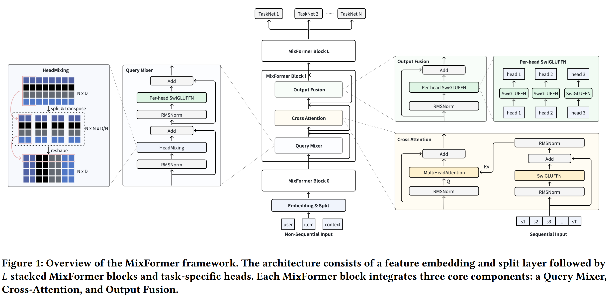
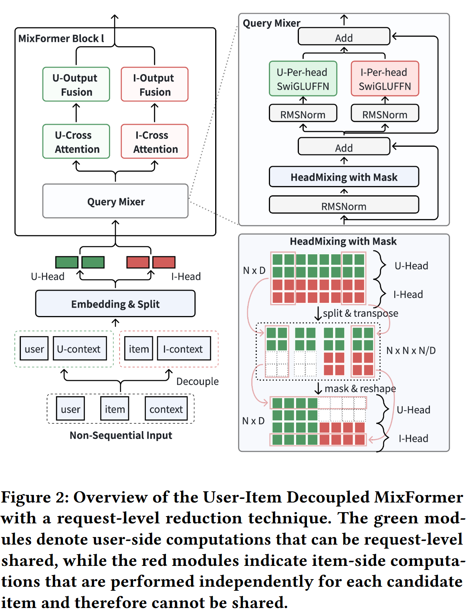

# MixFormer: Co-Scaling Up Dense and Sequence in Industrial Recommenders

MixFormer - 工业推荐系统中稠密特征与序列建模的协同缩放

**作者单位**：字节跳动（ByteDance）

**论文来源**：arXiv:2602.14110v1 [cs.IR], 2026 

------

## 1. 研究背景与动机 (Motivation)

### 1.1 工业推荐进入“缩放驱动”时代

- 现代推荐系统的性能提升日益依赖于数据规模和模型容量的扩张，而非手工特征。
- **核心组件**：用户行为序列建模（Sequence Modeling）与高阶稠密特征交互（Dense Feature Interaction）。

### 1.2 现有架构的瓶颈：碎片化设计

- **主流方案**：现有的方案（如 SIM, OneTrans）通常采用“分层堆叠”或“并行串联”。
- **参数隔离与竞争**：序列模块和稠密模块具有独立的参数空间，在有限算力预算（FLOPs）下，增加序列长度会挤压稠密参数的扩展空间，反之亦然。
- **缺乏深层交互**：序列建模通常仅与原始 ID 特征对齐，缺乏高阶特征语义的指引。

------

## 2. 核心架构：MixFormer (Methodology)

MixFormer 提出了**统一参数化（Unified Parameterization）**范式，将序列建模与特征交互整合在单个 Transformer 背骨网络中。

### 2.1 统一的 MixFormer Block 

每个 Block 包含三个关键模块，对标标准 Transformer Decoder 的组件：

#### ① Query Mixer（对应 Self-Attention）

$$P = [p_1, \dots, p_N] = \text{HeadMixing}(\text{Norm}(X)) + X$$

$$q_i = \text{SwiGLUFFN}(\text{Norm}(p_i)) + p_i$$

- **问题**：异构特征空间（用户/物品/上下文）直接做内积相似度不可靠且开销大。
- **解决方案**：引入 **HeadMixing**。这是一种参数无关的操作，通过重塑（Reshape）和转置（Transpose）强制跨头信息交换。
- **Per-head SwiGLUFFN**：为每个特征头独立实例化 FFN，保持表达的多样性并处理特征异构性。

#### ② Cross Attention（序列聚合）

$$h_t = \text{SwiGLUFFN}^{(l)}(\text{Norm}(s_t)) + s_t \in \mathbb{R}^{ND}$$

$$k_t^i = W_k^i h_t^i, \quad v_t^i = W_v^i h_t^i$$

$$z_i = \sum_{t=1}^T \text{softmax} \left( \frac{q_i (k_t^i)^\top}{\sqrt{D}} \right) v_t^i$$

- **高阶 Query**：使用 Query Mixer 生成的高阶语义向量作为 Query，对用户行为序列进行对齐。
- **深度交互**：使高阶特征语义直接参与序列权重的分配，增强了捕捉复杂兴趣对齐的能力。

#### ③ Output Fusion（对应 FFN）

$$o_i = \text{SwiGLUFFN}(\text{Norm}(z_i)) + z_i$$

- 采用 **Per-head SwiGLU** 网络，对序列和非序列信号进行非线性深度集成，生成下一层的输入。

------

## 3. 工业级效率优化：UI-MixFormer

为了支持大规模在线推理，论文提出了 **User-Item Decoupling（用户-项目解耦）** 策略。

### 3.1 核心机制：单向掩码 (Masking)

$$\text{HeadMixing}_{\text{decouple}}() = \mathcal{M} \odot \text{HeadMixing}()$$

$$\mathcal{M}[i, j] = \begin{cases} 0, & \text{if } i < N_U \text{ and } j \ge N_U \\ 1, & \text{otherwise} \end{cases}$$

- **特征分区**：将头分为用户侧 ($N_U$) 和项目侧 ($N_G$)。
- **信息隔离**：在 HeadMixing 过程中引入掩码矩阵 $\mathcal{M}$，强制执行“用户 $\to$ 项目”的单向流动，防止项目信号污染用户侧头。
- **算力节省**：用户侧计算（包括复杂的序列聚合）在单次请求中只需计算一次，即可被成百上千个候选项目复用（RLB 技术），实现约 **36% 的 FLOPs 削减**。

------

## 4. 实验分析 (Experiments)

### 4.1 离线实验结果 

- **基线对比**：在字节跳动万亿级工业数据集上，MixFormer 在 CTR（AUC/UAUC）任务上全面超越了分层架构（STCA+RankMixer）和并行架构（OneTrans）。
- **性能增益**：即使在相同参数量级下，统一架构也展现出显著的精度优势。

### 4.2 协同缩放定律 (Co-scaling Laws) 

- **稠密参数扩展**：在固定 FLOPs 预算下，MixFormer 表现出比非序列模型更强的缩放斜率。
- **序列长度扩展**：随着序列长度从 512 扩展至 10,000，MixFormer 的性能提升速率与最强序列基线（STCA）持平，证明其具备优秀的序列感知能力。

### 4.3 线上 A/B 测试 (Douyin & Douyin Lite) 

- **核心收益**：在线上环境，MixFormer 显著提升了用户活跃天数（Active Day）、使用时长（Duration）以及互动指标（Finish/Like）。

------

## 5. 结论与总结

- **统一性**：MixFormer 证明了将序列建模和特征交互统一在单个参数空间内是可行且高效的。
- **协同缩放**：解决了工业部署中由于参数隔离导致的算力资源分配瓶颈。
- **实战价值**：通过解耦优化突破了 Transformer 在大规模排序场景下的延迟限制，已在字节跳动核心业务中全量部署。

