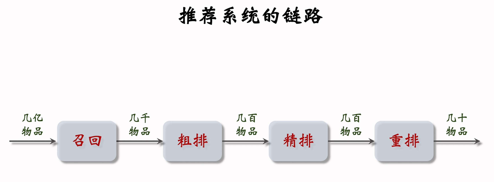
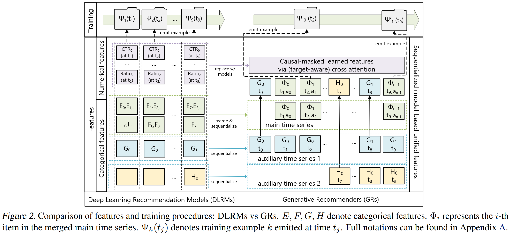
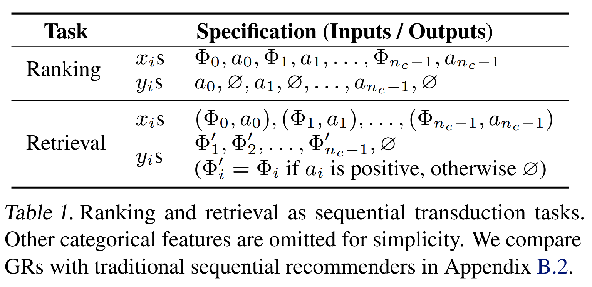
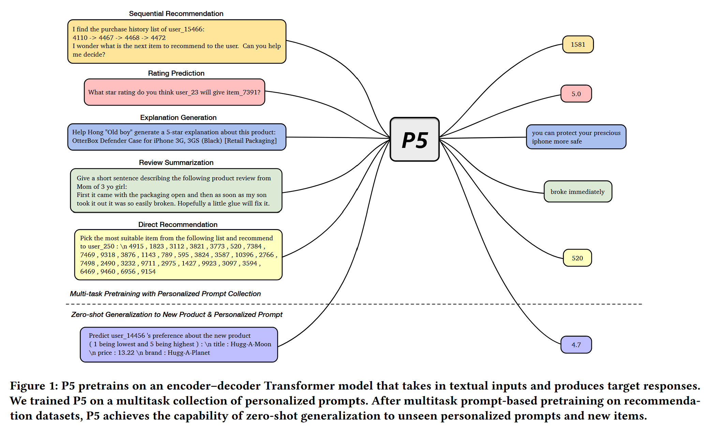
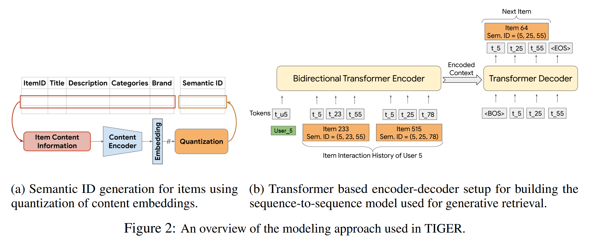
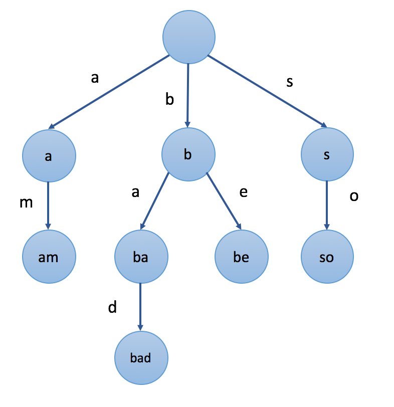
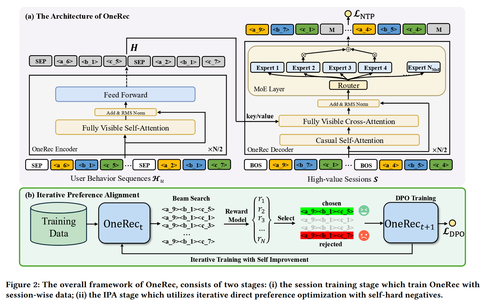

## 生成式推荐发展对比

### 传统判别式推荐->HSTU->P5->TIGER->OneRec

### 传统判别式推荐

#### 编码

ID：稀疏ID（Sparse ID）

使用稀疏的类别特征和数值特征进行训练。

类别特征：包括用户序列的item、item类别，用户加入的社区等。

数值特征：包括各种计数，比率以及加权等。

#### 召回

协同过滤、双塔模型，在向量空间中搜索最近邻（ANN）

#### 排序

特征交叉、序列建模，使用深度神经网络

### HSTU

提出用生成式推荐器GR取代DLRM，将推荐系统的召回排序重新表达为GR中的纯顺序推导问题。

#### 编码

ID：稀疏ID

将稀疏的类别特征和数值特征特征合并并编码为一个统一的时间序列。

#### 召回

根据之前的内容预测下一个内容，将用户的长程历史压缩成一个向量，依然使用传统的ANN，在库里找距离最近的向量。

#### 排序

对内容进行多任务预测（ctr、cvr），将候选物品的特征与 HSTU 生成的深度用户特征进行复杂的交叉计算，输出一个0到1之间的概率值。

### P5（Pretrain, Personalized Prompt, and Predict Paradigm）

将推荐系统问题用统一的基于prompt学习的sequence-to-sequence框架进行建模。（序列推荐、评分预测、推荐理由、评论、直接推荐）

#### 编码

ID：将稀疏ID视为特殊Token或直接使用物品标题（如iPhone 15 Pro）

特征：user-item交互行为数据、item的元数据、用户特征(如评论数据)被转成通用的"自然语言序列"格式，集成到个性化prompt模板中，作为模型的输入。

在预训练阶段，P5使用统一的模型和目标来进行多任务预训练，因此拥有适用不同下游推荐任务的能力。

#### 召回

模型接收用户的历史行为，直接生成下一个物品的 ID。但ID时容易出现“幻觉”（生成的ID不在库里），所以通常通过受限搜索来确保生成的Token组合指向真实的商品。

#### 排序

Rating Prediction、Direct Recommendation

#### 与HSTU对比

| **维度**         | **HSTU (架构进化)**         | **P5 (范式确立)**            |
| ---------------- | --------------------------- | ---------------------------- |
| **数据格式**     | Embedding 向量 + 行为序列   | 自然语言文本 (Prompts)       |
| **模型大脑**     | 判别式 Transformer (只看分) | 生成式 Transformer (会说话)  |
| **统一性**       | 召回/排序仍需独立设计任务   | 全任务统一为 Text-to-Text    |
| **核心贡献**     | 证明了计算长序列的效率      | 确立了推荐即生成的范式       |
| **对 ID 的态度** | 只是一个索引号              | 是语言的一部分，具有语义关联 |

### TIGER

#### 编码

语义ID（Semantic ID）：用RQ-VAE（残差量化自动编码器）将物品特征压缩成一串层级化的整数序列。

通过用户过去交互过的物品SID序列预测下一个物品SID的每一个Token。

#### 召回

**受限束搜索**

前缀树（Trie）

- 模型预测第一位token；
- 前缀树约束：强制模型只能在树上存在的数字里选；
- 束搜索（Beam Search）：保留概率最高的K条路径，逐位向下延伸。

#### 排序

无

#### 与P5对比

| **维度**     | **P5 (范式确立)**            | **TIGER (召回突破)**            |
| ------------ | ---------------------------- | ------------------------------- |
| **ID 本质**  | 原子 ID / 纯文本 (无规律)    | 语义 ID (层级规律)              |
| **检索瓶颈** | 处理大规模库时效率低、易幻觉 | 高效、精准 (通过 Trie 消除幻觉) |
| **模型理解** | 像背诵杂乱的条目             | 像理解层级化的分类百科          |
| **技术核心** | Prompt + NTP                 | RQ-VAE + Semantic ID + Trie     |

### OneRec

**单阶段生成推荐框架**

不再只用NTP来训练，而是引入了DPO，根据最终业务结果给模型反馈，因此可以让模型学会权衡：它知道虽然物品A点击率高，但物品B的转化价值（GMV）更高，从而在生成时自动向高价值目标对齐。

#### 编码

原始特征：全模态输入。不仅包括标题，还包括商品的图像特征、视频摘要、以及极其精细的用户行为反馈（如：停留时长、滑过速度）。

ID：继承了TIGER的Semantic ID，但一个物品不仅有一个“检索 ID”，还带有一串“属性 Token”。

#### 召回&排序

会话级生成任务

OneRec 的输出是一个视频列表，由一个会话$\boldsymbol{S}=\{\boldsymbol{v}_1,\boldsymbol{v}_2,...,\boldsymbol{v}_m\}$组成，其中$m$是会话中视频的数量。一个会话是指根据用户请求返回的一批短视频，通常由5到10个视频组成。

#### 与TIGER对比

| **对比维度** | **TIGER (2023)**       | **OneRec (2025)**            |
| ------------ | ---------------------- | ---------------------------- |
| **主要目标** | 优化检索（召回）阶段   | 统一检索与排序全流程         |
| **生成单位** | 单个物品 (Point-wise)  | 完整物品列表 (Session-wise)  |
| **对齐策略** | 无显式偏好对齐         | 迭代偏好对齐 (IPA) + DPO     |
| **扩展技术** | 标准 Transformer       | 稀疏专家模型 (MoE)           |
| **模型规模** | 约 13M (实验级)        | 约 1B (工业部署级)           |
| **核心贡献** | 证明生成式检索的可行性 | 实现端到端单阶段生成推荐系统 |

### DLRM->LLM4DLRMs->LLM4GRs