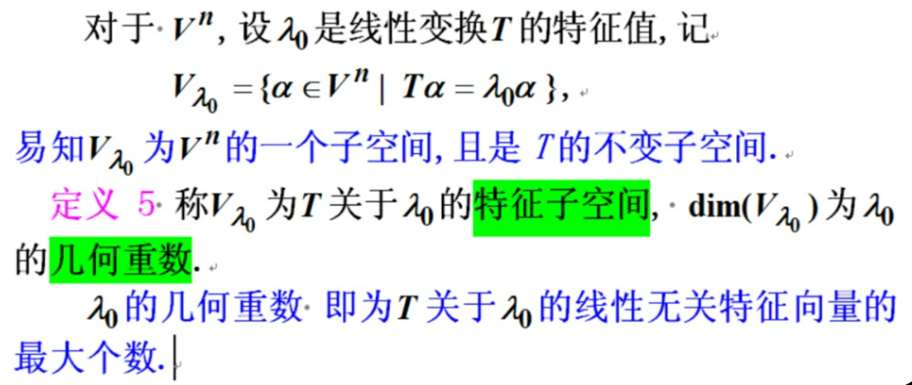
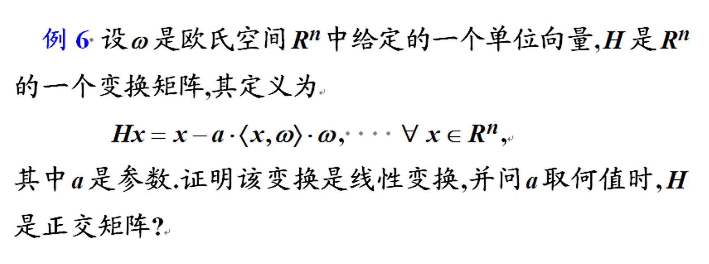

# 高工

## 《矩阵论及其应用》第1章§2线性变换及其矩阵表示3

这是一个非常敏锐的观察。你之所以在练习题中经常看到“一个特征值对应一个线性无关特征向量”，主要是因为题目中给出的特征值大多是**单根（代数重数为 1）**。

根据你上传的图片，特征子空间 $V_{\lambda_0}$ 的维度 $\dim(V_{\lambda_0})$ 被定义为该特征值的**几何重数**。几何重数即为对应于 $\lambda_0$ 的线性无关特征向量的最大个数。

通常情况下，几何重数总是满足：$1 \le$ **几何重数** $\le$ **代数重数**（该根在特征方程中出现的次数）。

------

### 1. 为什么你很少见到“多个向量”？

在基础练习中，为了简化计算，矩阵的特征根通常互不相同。当一个特征值是单根时，它的代数重数是 1，因此几何重数也必须是 1。这就导致了你感知到的“一对一”现象。

------

### 2. 反例：一个特征值对应多个线性无关向量

当特征值是**重根（代数重数 > 1）**时，就可能出现多个线性无关的特征向量。

#### 例子 A：单位矩阵（最极端的情况）

设 $I = \begin{pmatrix} 1 & 0 \\ 0 & 1 \end{pmatrix}$。

- **特征方程**：$(\lambda - 1)^2 = 0$。特征值 $\lambda = 1$ 是一个二重根（代数重数 = 2）。
- **求解特征向量**：对于 $\lambda = 1$，我们要解 $(I - 1I)x = 0$，即 $0x = 0$。
- **结论**：平面内**任何**非零向量都是它的特征向量。你可以选出 $\alpha_1 = (1, 0)^T$ 和 $\alpha_2 = (0, 1)^T$。它们是线性无关的，且都对应同一个特征值 $1$。
- **几何重数**：此时 $\dim(V_1) = 2$。

#### 例子 B：对角矩阵

设 $A = \begin{pmatrix} 2 & 0 & 0 \\ 0 & 2 & 0 \\ 0 & 0 & 5 \end{pmatrix}$。

- 特征值 $\lambda_1 = 2$ 是二重根。
- 对应的特征子空间 $V_2$ 是由 $(1, 0, 0)^T$ 和 $(0, 1, 0)^T$ 张成的二维平面。
- 这里一个特征值 $2$ 就对应了**两个**线性无关的特征向量。

------

### 3. 注意区分：特征向量与几何重数

在你的图片中提到：

> $\lambda_0$ 的几何重数即为 $T$ 关于 $\lambda_0$ 的线性无关特征向量的最大个数。

- **可对角化的矩阵**：几何重数 = 代数重数。例如上面的单位矩阵。
- **不可对角化的矩阵（缺陷矩阵）**：几何重数 < 代数重数。例如 $J = \begin{pmatrix} 2 & 1 \\ 0 & 2 \end{pmatrix}$。虽然 $\lambda=2$ 是二重根，但它只能找到一个线性无关的特征向量 $(1, 0)^T$。

------

### 总结

你没看到反例，是因为还没遇到**重根**或者**可对角化的重根矩阵**。在实际的 AI 模型（如 PCA 降维或推荐系统中的奇异值分解）中，经常会遇到特征值相等的情况，那时候一个特征值就会撑起一个多维的特征子空间。

## 《矩阵论及其应用》第1章§3内积空间1

这道题目（例 6）考察的是线性代数中**线性变换**的验证以及**正交矩阵**的性质。它涉及到的变换实际上是数学中非常有名的 **Householder 变换**（当 $a=2$ 时）。

以下是详细的解题步骤：

### 1. 证明该变换是线性变换

要证明 $H$ 是线性变换，需要验证它满足**可加性**和**齐次性**。

- 验证可加性：对任意 $x, y \in R^n$

  $$H(x+y) = (x+y) - a \langle x+y, \omega \rangle \omega$$

  利用内积的性质 $\langle x+y, \omega \rangle = \langle x, \omega \rangle + \langle y, \omega \rangle$，得：

  $$H(x+y) = x + y - a(\langle x, \omega \rangle + \langle y, \omega \rangle) \omega$$

  $$H(x+y) = (x - a \langle x, \omega \rangle \omega) + (y - a \langle y, \omega \rangle \omega) = Hx + Hy$$

  可加性成立。

- 验证齐次性：对任意 $x \in R^n$ 及标量 $c$

  $$H(cx) = (cx) - a \langle cx, \omega \rangle \omega$$

  利用内积的性质 $\langle cx, \omega \rangle = c \langle x, \omega \rangle$，得：

  $$H(cx) = cx - ac \langle x, \omega \rangle \omega = c(x - a \langle x, \omega \rangle \omega) = cHx$$

  齐次性成立。

**结论**：由于满足可加性和齐次性，该变换是线性变换。

------

### 2. 求解 $a$ 取何值时，$H$ 是正交矩阵

正交矩阵（或正交变换）的一个核心特性是**保范性**，即经过变换后向量的长度保持不变：$\|Hx\|^2 = \|x\|^2$。

1. 计算 $\|Hx\|^2$：

   $$\|Hx\|^2 = \langle Hx, Hx \rangle = \langle x - a \langle x, \omega \rangle \omega, x - a \langle x, \omega \rangle \omega \rangle$$

2. 展开内积：

   $$\|Hx\|^2 = \langle x, x \rangle - 2a \langle x, \omega \rangle \langle x, \omega \rangle + a^2 \langle x, \omega \rangle^2 \langle \omega, \omega \rangle$$

3. **利用已知条件**：

   - $\langle x, x \rangle = \|x\|^2$

   - $\omega$ 是单位向量，所以 $\langle \omega, \omega \rangle = 1$

     $$\|Hx\|^2 = \|x\|^2 - 2a \langle x, \omega \rangle^2 + a^2 \langle x, \omega \rangle^2 = \|x\|^2 + (a^2 - 2a) \langle x, \omega \rangle^2$$

4. 建立等式：

   要使 $\|Hx\|^2 = \|x\|^2$ 对所有 $x$ 恒成立，必须满足：

   $$(a^2 - 2a) \langle x, \omega \rangle^2 = 0$$

   由于 $\omega \neq 0$，这意味着系数必须为零：

   $$a^2 - 2a = 0 \implies a(a - 2) = 0$$

**结论**：当 **$a = 0$** 或 **$a = 2$** 时，$H$ 是正交矩阵。

------

### 💡 几何意义补充

- 当 **$a = 0$** 时：$Hx = x$，这是**单位变换**（恒等映射），矩阵 $H = I$ 显然是正交的。
- 当 **$a = 2$** 时：$Hx = x - 2 \langle x, \omega \rangle \omega$，这是关于垂直于 $\omega$ 的超平面的**反射变换**（Householder 反射）。在几何上，反射不改变向量长度，因此它是正交变换。

